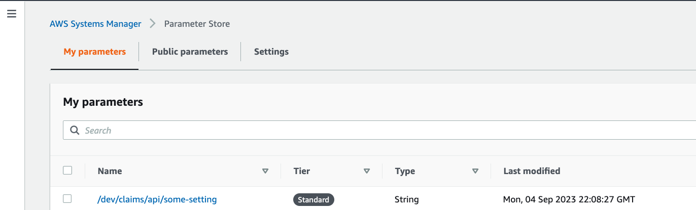

<!-- TOC -->

- [Overview](#overview)
- [Setting up new Parameter](#setting-up-new-parameter)

<!-- TOC -->

# Overview

This project aims to create our own internal library which provides these 2 functionalities:

- Allow developers (and maybe other team in the business) to create new parameter in our AWS environments easily
- Allow developers to compare parameters and their values in different AWS accounts easily

# Setting up new Parameter

---
This guide assumes that you already have your AWS profiles set properly on your local machine
inside `~/.aws/credentials` as well as `~/.aws/config` files

In order to set up a new parameter, user can run `python main.py` file from the root directory of the project

They will then be greeted with a list of AWS profiles you have on your machine and you need to select which profile (and
therefore which AWS account) you want to use to set the parameter. It looks something like below:

```shell
> default
ssm - rc
SSM - RC - 419438567813
ssm - uat
ssm - staging
op_dev_customreadonly
op_dev_rnd_admin
op_dev_power_user            
```

You can use your up and down arrow key to navigate between the different choices of AWS profile in this list and select
the one you want to use by pressing `enter` on your keyboard. You can also jump to a specific profile here by pressing
the forward slash `/` key on your keyboard and start typing the name of the profile you want to use.

Next, you will be greeted with a list of environment options where you want to create the new SSM parameter in. The
options look like this:

```shell
> DEV_CLAIMS
DEV_SALES
DEV_RAPTOR
DEV_INFRA
DEV
STAGE
PROD      
```

Then, once you select the environment you want by pressing `enter`, you will be greeted with this message below:

```shell
parameter name: /dev/claims
What is the service name you want to set parameter for? 
```

User can then choose which service they want to set the api for. Below is a table on the mapping between service name
and our backend project

| Project Name            | Service Name   |
| ----------------------- | -------------- |
| **open-platform**       | api            |
| **enrichment-services** | api-enrichment |
| **solera-service**      | api-solera     |
| **service-aggregator**  | api-aggregator |

For instance, if user wants to set a new parameter for `open-platform`, the service name user must specify is `api`. Then, user should press enter to confirm his choice.

Next, user must specify the name of the variable that will be associated with the value that they want to set.

```shell
parameter name: /dev/claims/api
What is the name of the setting you want to set parameter for? 
```
There are 2 simple rules for for the naming of a setting:
- it must be written with lowercase letters
- if it contains multiple words, you need to specify it in snake case format **(`some_setting`)**

Suppose that the user specifies `some_setting` in this case and press `enter`; they will then be greeted with the final question which asks them the value they want to set for this parameter.

```shell
parameter name: /dev/claims/api/some_setting
What is the value the parameter will store? 
```

Suppose that you enter `27` right here, the program will then create this new SSM parameter store and display the full parameter name as well as the value the parameter is set to like this:

```shell
What is the value the parameter will store? 27
/dev/claims/api/some-setting = 27 # full parameter name and value are displayed
```

Going to the AWS SSM Parameter Store, you will then be able to see a new SSM parameter created




# Download all SSM parameter store values into `.ini` file

The Python application gives user the ability to download all AWS SSM parameter store `String` and `SecureString` parameters into an `.ini` file. All user needs to do is to run this command:

```shell
python ./create_local_ini.py \
--prefixes /foo /bar / \
--outputfile {path_to_ini_file}
```

The command above forces the application to search for parameters with `/foo` prefix first before checking if there's any parameter name with the same name specified with `/bar` prefix

`{path_to_ini_file}` is path to the ini file like ~/Documents/temp/local.ini for example


