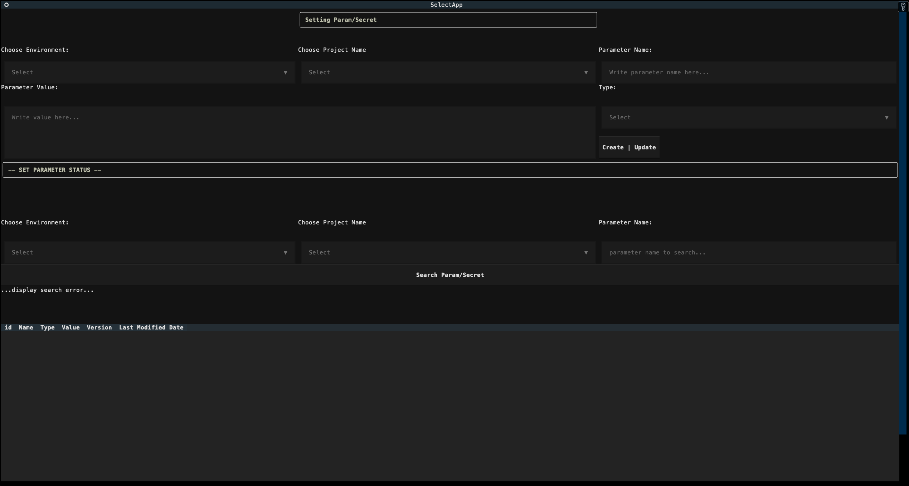
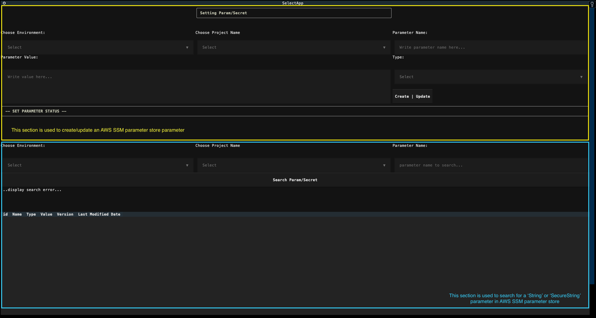

<!-- TOC -->

- [Overview](#overview)
  - [Objective](#objective)
  - [AWS SSM Parameter Store Naming Scheme](#aws-ssm-parameter-store-naming-scheme)
- [Running the Application](#running-the-application)
- [Using the Application](#using-the-application)
  - [Create/Update SSM Parameter](#createupdate-ssm-parameter)
  - [Search for SSM Parameter](#search-for-ssm-parameter)
- [Download all SSM parameter store values into `.ini` file](#download-all-ssm-parameter-store-values-into-ini-file)

<!-- TOC -->

# Overview

## Objective
This project aims to create a simple terminal UI application which provides these 2 functionalities:

- Allow developers (and maybe other team in the business) to create new parameter in our AWS environments easily
- Allow developers to compare parameters and their values in different AWS accounts easily

## AWS SSM Parameter Store Naming Scheme

AWS SSM Parameter Store provides a mechanism for users to store parameters and secrets in a hierarchical directory/path structure *(this is called **[parameter hierarchies](https://docs.aws.amazon.com/systems-manager/latest/userguide/sysman-paramstore-hierarchies.html)** in SSM Parameter Store)*.

This system allows us to define a parameter name in this format:

```
/<environment>/<service_name>/<parameter_name>
```

# Running the Application
---

This guide assumes that you already have your AWS profiles set properly on your local machine
inside `~/.aws/credentials` as well as `~/.aws/config` **files**

---

1. Setting up `.env` File
   
   First, you need to setup a `.env` file at the root directory of the project. User can use these environment variables to tell the appplication which AWS profile(s) the application should use to connect to the AWS account SSM parameter store(s)
   
   At the time of this writing, the application is setup to only accept these 3 environment variables:

   ```python
   # content of '.env' file
   DEV_AWS_PROFILE=xxx
   STAGE_AWS_PROFILE=xxx
   PROD_AWS_PROFILE=xxx
   ```
   The application would then use the specified AWS profile name to connect to the corresponding AWS account SSM parameter store based on the AWS profile provided ***(replace 'xxx' above with AWS profile names you want)***

   
2. Install all required Python packages by doing `pip install -r requirements.txt`
3. Run `python main.py` on your terminal session ***(ideally on linux OS terminal/[iTerm2](https://iterm2.com/) on macOS)***

and you'll be greeted with the terminal UI below




# Using the Application

There are 2 main sections in this terminal app:
- the first section at top of of the terminal UI allows user to create/update AWS SSM parameter **store**
- the second section at the bottom is designed to allow user to search for specific parameters in AWS SSM parameter store



## Create/Update SSM Parameter

This guide focuses on the top section of the terminal UI
- Click **"Choose Environment"** dropdown menu and select which environment you want to use when creating/updating the specified parameter 
- Click **"Choose Project Name** which project this parameter belongs to
- Click **"Parameter Name** textbox to specify the parameter name you'd like to create/update. 
  - ***This app is going to force you to start the name of the parameter with a forward slash '/'***
- Write the value you want to assign to this parameter in inside the **"Parameter Value"** text box
  - ***This will simply update the parameter value and assign a new version to the parameter if parameter with the same name already exists in AWS SSM parameter store***
- Select the **"Type"** of the parameter; it can either be:
  - a `parameter` (an AWS SSM parameter store `String` parameter) OR
  - a `secret` (an AWS SSM parameter store `SecureString` parameter) 
- Click **"Create | Update** button to create/update the parameter

## Search for SSM Parameter
This guide focues on the bottom section of the terminal UI
- Click **"Choose Environment"** dropdown menu and select which environment you want to use when searching for the parameter
- Click **"Choose Project Name** which project this parameter belongs to
- Click **"Parameter Name** textbox to specify a pattern we'd like to search in AWS SSM parameter store
  - For instance, suppose we have these 3 parameters setup in our AWS SSM parameter store:
    ```
    /foo="foo" 
    /foo/bar/one=1
    /foo/bar/two=2
    /lorem/ipsum/one=lorem_1
    /lorem/ipsum/two=lorem_2
    ```

    if we specify `/foo/bar` as the search term under this `Parameter Name` section, the terminal UI will return 2 entries:
    ```
    /foo/bar/one=1
    /foo/bar/two=2
    ```

    and if we specify `/foo`, it will return these 3 entries:

    ```
    /foo="foo" 
    /foo/bar/one=1
    /foo/bar/two=2
    ```


- Click **Search Param/Secret** button and the program should return a list of entries of parameters which matches the parameter name pattern specified by user


# Download all SSM parameter store values into `.ini` file
---

***Work In Progress Feature***

This feature will be a part of the terminal UI in the future

---

The Python application gives user the ability to download all AWS SSM parameter store `String` and `SecureString` parameters into an `.ini` file. All user needs to do is to run this command:

```shell
python ./create_local_ini.py \
--prefixes /foo /bar / \
--outputfile {path_to_ini_file}
```

The command above forces the application to search for parameters with `/foo` prefix first before checking if there's any parameter name with the same name specified with `/bar` prefix

`{path_to_ini_file}` is path to the ini file like ~/Documents/temp/local.ini for example


